# VendorRisk Copilot

End-to-end procurement and vendor-risk automation platform that turns invoices, tickets, contracts, and vendor master data into scored risk signals, contract evidence, and automation-ready actions.

## Problem

Procurement teams manage vendor risk across disconnected spreadsheets, AP queues, support dashboards, and contract folders. That fragmentation creates blind spots: duplicate invoices slip through, compliance evidence goes stale before renewal, SLA breaches are not tied to contract rights, and leadership cannot quantify preventable financial exposure.

## Solution

VendorRisk Copilot ingests vendor operational data, validates it, builds vendor-level features, trains an ML risk model, retrieves contract clauses with local RAG, orchestrates analysis through a LangGraph workflow, and exposes results via FastAPI, Streamlit, n8n, and MLflow. Stakeholders get a portfolio view, vendor drill-down, source-grounded contract evidence, recommended actions, and ROI estimates without requiring paid LLM APIs.

## Why This Is an AI Solutions Engineering Project

This is not a notebook demo. It demonstrates how an AI solutions engineer moves from messy operational data to production-shaped systems:

- **Data engineering and governance** — schema validation, referential integrity, and feature pipelines
- **Applied ML** — model training, comparison, persistence, drift monitoring, and MLflow tracking
- **Retrieval and grounding** — contract RAG with FAISS and sentence-transformers for evidence-backed outputs
- **Agent orchestration** — LangGraph workflow that chains validation, scoring, retrieval, explanation, and automation
- **Product surfaces** — FastAPI API, Streamlit BI dashboard, Docker deployment, and n8n handoff payloads
- **Business translation** — exposure estimation, procurement recommendations, and ROI simulation for executives

## Architecture

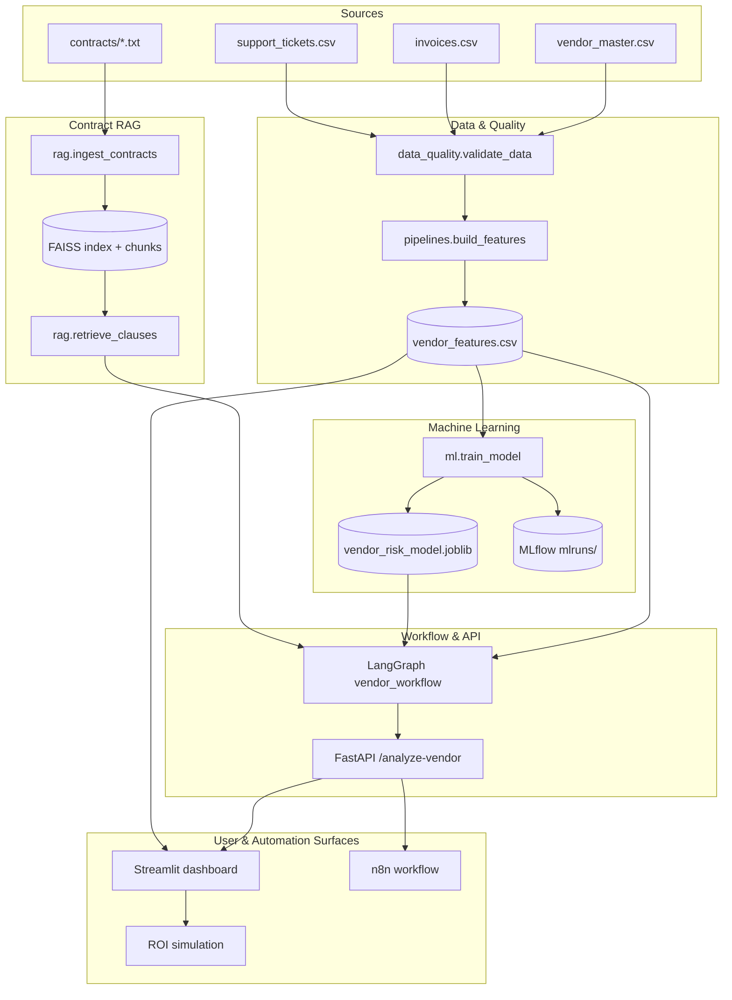

See [docs/architecture.md](docs/architecture.md) for a component-by-component breakdown.

## Tech Stack

| Layer | Technologies |
| --- | --- |
| Language | Python 3.11 |
| API | FastAPI, Uvicorn, Pydantic |
| Dashboard | Streamlit, Plotly, Pandas |
| ML | scikit-learn, joblib, MLflow |
| RAG | sentence-transformers, FAISS |
| Orchestration | LangGraph, LangChain Core |
| Data quality | Great Expectations-style checks, Pandas |
| Automation | n8n (example workflow JSON) |
| Deployment | Docker, docker-compose |
| Testing | pytest, httpx |

## Features

| Feature | Description |
| --- | --- |
| **Data validation** | Validates schemas, allowed values, date logic, referential integrity, duplicate invoices, PO mismatches, and missing compliance evidence |
| **ETL pipeline** | Aggregates raw CSVs into one vendor-level feature row with spend, invoice, ticket, SLA, renewal, and compliance signals |
| **ML risk model** | Trains LogisticRegression and RandomForestClassifier, selects the best model by F1, and scores vendors with explainable top factors |
| **Contract RAG** | Chunks contract text, embeds clauses locally, and retrieves payment, SLA, compliance, renewal, and termination evidence |
| **LangGraph workflow** | Chains validation, feature load, ML scoring, contract retrieval, explanation, procurement action, and automation payload generation |
| **n8n automation** | Importable n8n workflow calls `/analyze-vendor`, branches on risk level, sends high-risk Slack alerts, and appends review rows to Google Sheets |
| **BI dashboard** | Portfolio KPIs, risk distribution, SLA and invoice charts, renewal timeline, vendor drill-down, and high-risk queue |
| **MLflow tracking** | Logs model parameters, metrics, and artifacts for experiment comparison and auditability |
| **ROI simulation** | Estimates duplicate invoice, pending/overdue, SLA penalty, and renewal exposure with a total preventable exposure formula |

## Setup

```bash
python -m venv .venv
source .venv/bin/activate   # Windows: .venv\Scripts\activate
pip install -r requirements.txt
cp .env.example .env
```

Optional environment variables:

```bash
SENTENCE_TRANSFORMER_MODEL=all-MiniLM-L6-v2
API_BASE_URL=http://localhost:8000
```

Generate the demo corpus (first-time setup):

```bash
python -m src.data_generation.generate_synthetic_data
python -m src.data_quality.validate_data
python -m src.pipelines.build_features
python -m src.rag.ingest_contracts
python -m src.ml.train_model
```

## Local Run Commands

```bash
# Build or refresh artifacts
python -m src.pipelines.build_features
python -m src.rag.ingest_contracts
python -m src.ml.train_model

# Start API
uvicorn src.api.main:app --reload

# Start dashboard (separate terminal)
streamlit run dashboard/app.py

# Inspect MLflow runs (MLflow 3+ requires this for the local ./mlruns file store)
# PowerShell:
$env:MLFLOW_ALLOW_FILE_STORE="true"; mlflow ui
# bash:
# MLFLOW_ALLOW_FILE_STORE=true mlflow ui
```

Additional CLI utilities:

```bash
python -m src.rag.retrieve_clauses --vendor-name DataBridge --query "SLA compliance renewal"
python -m src.ml.predict_risk --vendor-id V001
python -m src.ml.monitor_drift
python -m src.agents.vendor_workflow --vendor-id V001
```

API docs: `http://127.0.0.1:8000/docs`

## MLOps & Monitoring

VendorRisk Copilot includes a local MLOps workflow using MLflow-compatible training scripts. The training pipeline compares Logistic Regression and Random Forest models, logs evaluation metrics, saves the best model artifact, stores the feature list, and creates a training baseline for monitoring.

The project also includes a lightweight drift-monitoring script that compares current vendor-risk features against the training baseline to detect changes in pending invoice exposure, SLA breach rate, compliance gaps, and duplicate invoice patterns.

Run locally:

```bash
python -m src.ml.train_model
python -m src.ml.monitor_drift
```

Model artifacts are saved under:

```
artifacts/model/
```

The deployed Render API runs in lightweight serving mode for reliability on the free tier, while the full local mode contains the ML/MLOps pipeline.

Full walkthrough: [docs/mlops.md](docs/mlops.md)

## Docker Run Commands

Generate artifacts on the host first, then start the stack:

```bash
python -m src.pipelines.build_features
python -m src.rag.ingest_contracts
python -m src.ml.train_model
docker compose up --build
```

| Service | URL |
| --- | --- |
| FastAPI | `http://127.0.0.1:8000` |
| Streamlit | `http://127.0.0.1:8501` |
| MLflow UI | `http://127.0.0.1:5000` |

`docker-compose.yml` mounts `./data`, `./artifacts`, and `./mlruns` so outputs persist between container restarts.

## Render Deployment (Free Tier)

The deployed Render API runs in lightweight mode for reliability on the free tier. Full local mode includes MLflow-tracked model training and FAISS/sentence-transformers contract RAG, while the public API uses rule-based scoring and lightweight keyword retrieval with the same response schema.

The API supports a **lightweight** deployment mode for memory-constrained hosts such as Render Free. Lightweight mode uses rule-based scoring and keyword contract retrieval only — no torch, sentence-transformers, FAISS, MLflow, or joblib model loading.

**Environment variables (Render dashboard):**

| Variable | Value |
| --- | --- |
| `DEPLOYMENT_MODE` | `lightweight` |
| `ENABLE_LLM_ON_RENDER` | `false` |
| `LLM_PROVIDER` | `none` |

**Build command:**

```bash
pip install -r requirements-render.txt
```

**Start command:**

```bash
uvicorn src.api.main:app --host 0.0.0.0 --port $PORT
```

**Required committed data (no `artifacts/` needed in lightweight mode):**

- `data/processed/vendor_features.csv`
- `data/contracts/*.txt`

**Verify after deploy:**

```bash
curl https://your-service.onrender.com/health
curl https://your-service.onrender.com/debug-files
curl -X POST https://your-service.onrender.com/analyze-vendor \
  -H "Content-Type: application/json" \
  -d "{\"vendor_id\":\"V001\"}"
```

Local development continues to use `DEPLOYMENT_MODE=full` (default) with the full `requirements.txt` stack and ML/RAG artifacts.

## API Examples

Health and discovery:

```bash
curl http://127.0.0.1:8000/
curl http://127.0.0.1:8000/health
curl http://127.0.0.1:8000/vendors
curl http://127.0.0.1:8000/vendor-risk-summary
```

Analyze a high-risk vendor:

```bash
curl -X POST http://127.0.0.1:8000/analyze-vendor \
  -H "Content-Type: application/json" \
  -d "{\"vendor_id\":\"V001\"}"
```

Example response fields:

- `vendor_id`, `vendor_name`
- `risk_score`, `risk_level`
- `top_risk_factors`
- `retrieved_contract_evidence`
- `explanation`, `recommended_action`
- `estimated_financial_exposure`
- `human_review_required`
- `automation_payload`

## Workflow Automation

VendorRisk Copilot includes a self-hosted n8n Community Edition workflow that calls the FastAPI risk-analysis endpoint, checks vendor risk level, sends high-risk alerts to Slack, and appends review records to Google Sheets. This demonstrates RPA-style business workflow automation using an importable n8n workflow.

Import `n8n/vendor_risk_workflow.example.json` into n8n and follow [docs/n8n_setup.md](docs/n8n_setup.md) to connect FastAPI, Slack, and Google Sheets.

See [Screenshots](#screenshots) for the n8n canvas, Slack alert, and Google Sheets tracker.

## Screenshots

Visual walkthrough of the VendorRisk Copilot surfaces. All images live in [`Screenshots/`](Screenshots/).

### Streamlit BI Dashboard

Full dashboard sequence from executive KPIs through vendor drill-down, contract evidence, portfolio charts, high-risk queue, and ROI simulation.

**1. Executive summary and vendor analysis**

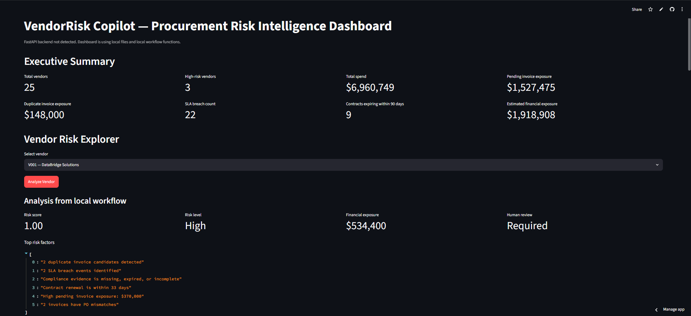

**2. Recommendation, explanation, contract evidence, and automation payload**

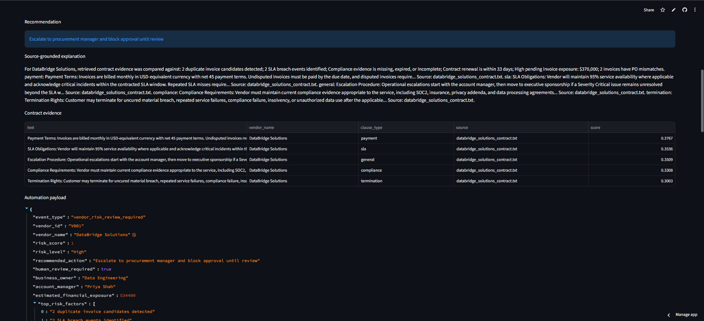

**3. Automation payload and portfolio BI charts**

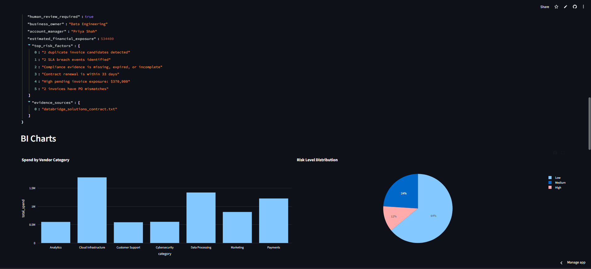

**4. SLA breaches, pending invoice exposure, compliance, and renewal timeline**

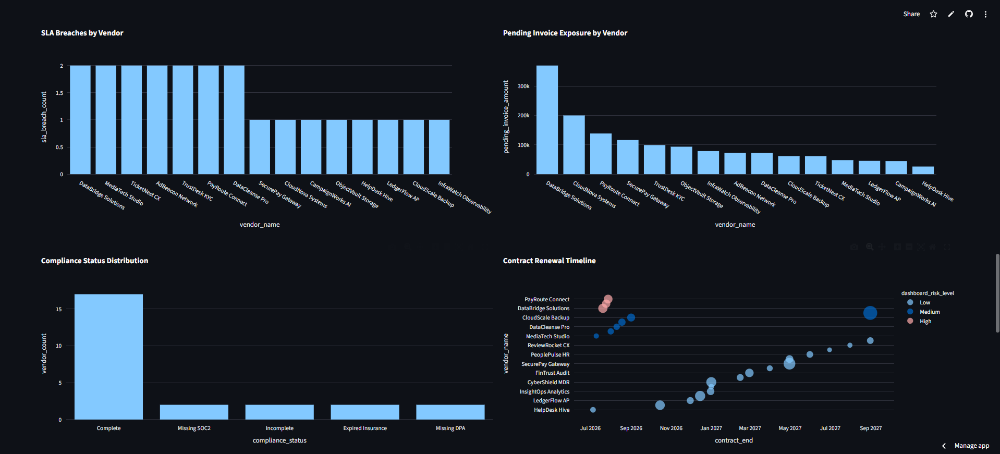

**5. Duplicate invoice count and high-risk review queue**

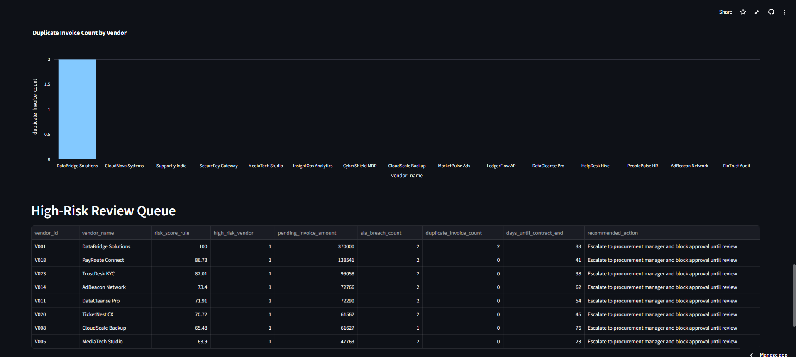

**6. High-risk queue and ROI simulation**

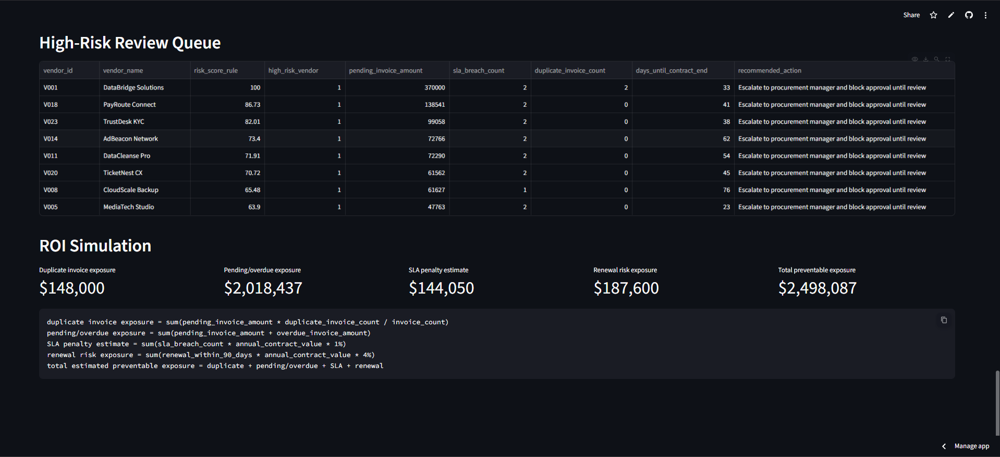

### n8n Workflow Automation

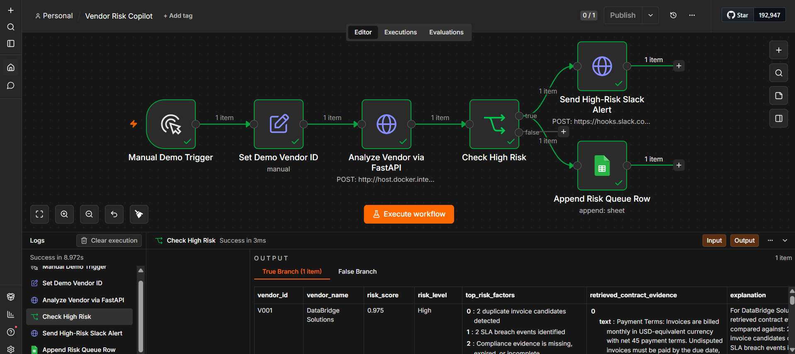

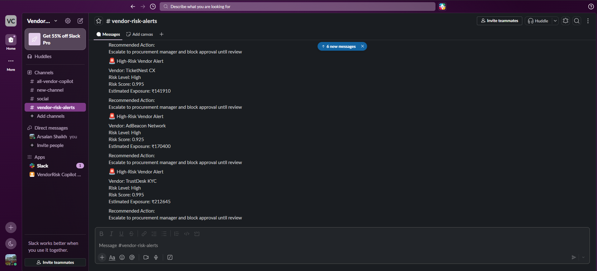

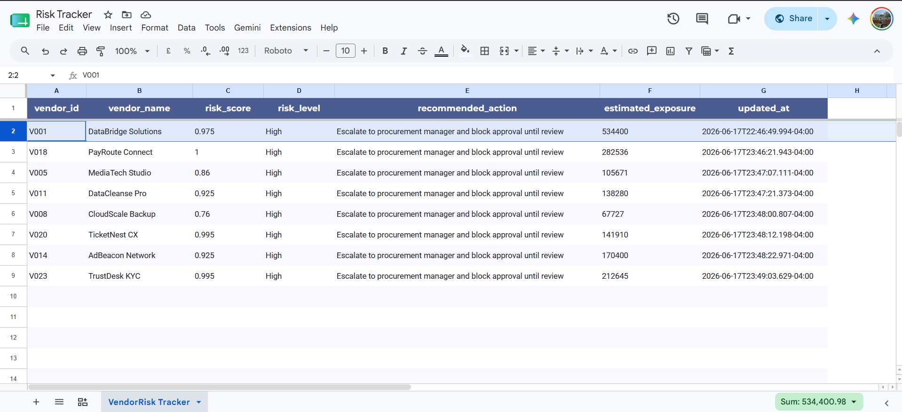

### MLOps & Drift Monitoring

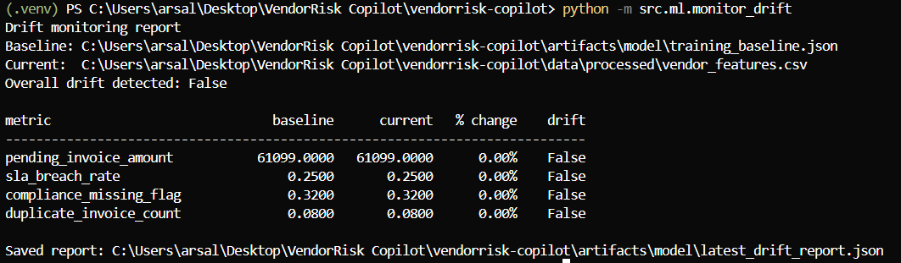

## Business Impact / ROI

VendorRisk Copilot quantifies value across four exposure buckets:

1. **Duplicate invoice exposure** — pending spend tied to duplicate invoice candidates
2. **Pending and overdue exposure** — unpaid invoice backlog at risk vendors
3. **SLA penalty exposure** — estimated contractual penalties from breach counts
4. ** Renewal exposure** — contracts expiring within 90 days with material annual value

The dashboard aggregates these into **total estimated preventable exposure**. A fictional but realistic walkthrough for a 12-vendor pilot is in [docs/roi_case_study.md](docs/roi_case_study.md).

Example executive framing:

- Portfolio visibility replaces weekly spreadsheet reconciliation
- High-risk vendors trigger human review with contract evidence attached
- Automation payloads integrate with n8n, Slack, or ticketing systems
- MLflow provides an audit trail for model changes and drift reviews

## Limitations

- **Synthetic demo data** — the bundled corpus is deterministic and designed for portfolio demos, not production vendor feeds
- **No paid LLM required by design** — explanations and recommendations use deterministic templates; optional LLM providers are not wired in by default
- **Local RAG index** — contract retrieval uses on-disk FAISS artifacts rebuilt by `ingest_contracts`; there is no live document store or PDF parser
- **Batch scoring** — the API analyzes one vendor per request; there is no scheduled batch scoring or streaming ingestion
- **Single-tenant deployment** — no auth, RBAC, or multi-tenant isolation in the reference implementation
- **Exposure formulas are estimates** — financial exposure uses heuristic multipliers for demo storytelling, not legal or accounting sign-off

## Future Improvements

- Connect to real ERP/AP systems (SAP, NetSuite, Coupa) via connectors or CDC pipelines
- Add PDF contract ingestion with OCR and clause extraction
- Optional LLM summarization behind a provider abstraction (`LLM_PROVIDER`, Groq/OpenAI)
- Scheduled drift monitoring and alerting when feature distributions shift
- Batch scoring job and webhook callbacks for n8n or Azure Logic Apps
- AuthN/AuthZ, audit logging, and tenant-scoped artifact storage
- Model registry promotion workflow in MLflow with champion/challenger deployment

## Additional Documentation

| Document | Purpose |
| --- | --- |
| [docs/architecture.md](docs/architecture.md) | Component-by-component system design |
| [docs/roi_case_study.md](docs/roi_case_study.md) | Fictional 12-vendor ROI walkthrough |
| [docs/demo_script.md](docs/demo_script.md) | 3-minute live demo script |
| [docs/resume_bullets.md](docs/resume_bullets.md) | Resume and social copy variants |
| [docs/n8n_setup.md](docs/n8n_setup.md) | n8n import and webhook configuration |
| [docs/mlops.md](docs/mlops.md) | Training pipeline, MLflow tracking, drift monitoring |
